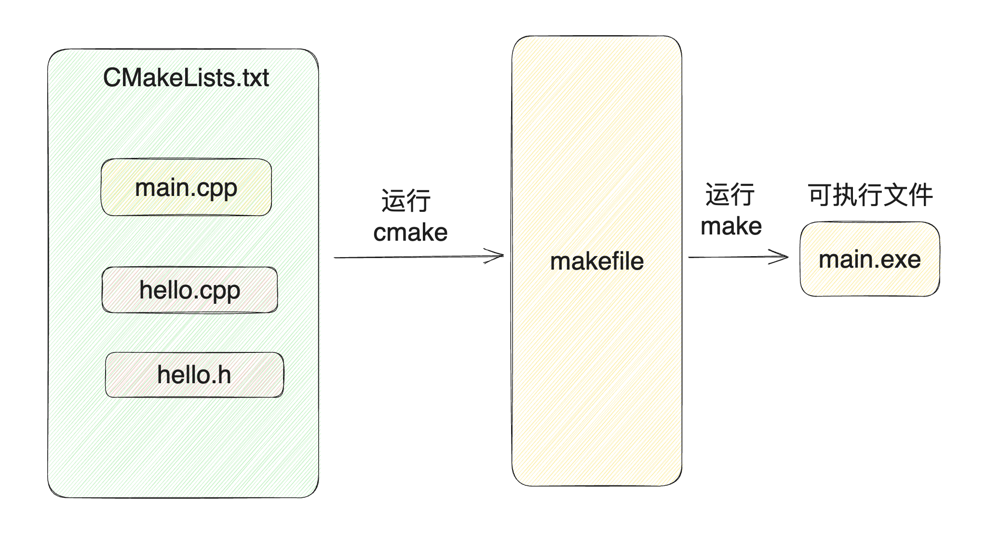

<style>
    .reveal h1, .reveal h2, .reveal h3, .reveal h4, .reveal h5 {
                  text-transform: none;
          }
</style>
# CMake与动态库
<div align=center> </div>

[@我不是匠人](https://space.bilibili.com/30639161)

---

## 大纲
- CMake概述
- 动态库和静态库
- GoogleTest

---

## CMake概述
- 开源
- 跨平台
- 构建C++
- 简化Makefile

---
<div align=center> </div>

---

## 快速使用
```cmake
# cmake至少3.16以上
cmake_minimum_required(VERSION 3.16)
# 工程名
project(cmake_study)
# 设置C++版本
set(CMAKE_CXX_STANDARD 14)
# 可执行文件
add_executable(main main.cpp)
```

---

## 子目录嵌套
```cmake
add_subdirectory(libhello)
```

---

## 动态库
```cmake
# 生成
add_library(hello SHARED hello.cpp hello.h)
# 使用
target_link_libraries(MY_EXE hello)
```

---

## 静态库
```cmake
# 生成
add_library(world STATIC hello.cpp hello.h)
# 使用
link_libraries(world)
```

---
## 目录结构
```shell
src
├── CMakeLists.txt
├── libhello
│   ├── CMakeLists.txt
│   ├── hello.cpp
│   └── hello.h
├── main.cpp
└── simple_test.cpp

```

---

## 致谢
- 感谢大家的给我的建议！
- 求一键三连！
